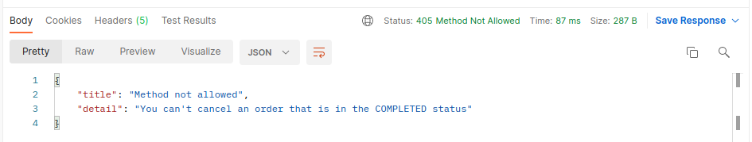

## Building REST services with Spring

REST is different from RPC (Remote Procedure Call) in the sense that with RPC there is no way to know how to interact with a service.
In this project, Spring HATEOAS is leveraged in order to build a RESTful service with not only the ability to provide hypermedia-driven outputs but also with high resiliency allowing the REST API to evolve safely without breaking clients.

### Setting up the project
- Java 17
- Maven build tool
- Spring Web
- Spring Data JPA
- H2 Database
- Spring HATEOAS

### RESTful representation 

Single employee resource containing data and links to other resources of the service:
```
{
  "id": 1,
  "name": "John Doe",
  "role": "developer",
  "_links": {
    "self": {
      "href": "http://localhost:8080/employees/1"
    },
    "employees": {
      "href": "http://localhost:8080/employees"
    }
  }
}
```

Collection of employee resources with new attributes without breaking old clients:
```
{
    "_embedded": {
        "employeeList": [
        {
            "id": 1,
            "firstName": "John",
            "lastName": "Doe",
            "role": "developer",
            "name": "John Doe",
            "_links": {
                "self": {
                    "href": "http://localhost:8080/employees/1"
                },
                "employees": {
                    "href": "http://localhost:8080/employees"
                }
            }
        },
        {
            "id": 2,
            "firstName": "Jane",
            "lastName": "Doe",
            "role": "designer",
            "name": "Jane Doe",
            "_links": {
                "self": {
                    "href": "http://localhost:8080/employees/2"
                },
                "employees": {
                    "href": "http://localhost:8080/employees"
                }
            }
        }
        ]
    },
    "_links": {
        "self": {
            "href": "http://localhost:8080/employees"
        }
    }
}
```

Collection of orders with different status and navigational links:
```
{
    "_embedded": {
        "orderList": [
        {
            "id": 3,
            "description": "iPhone",
            "status": "IN_PROGRESS",
            "_links": {
                "self": {
                    "href": "http://localhost:8080/orders/3"
                },
                "orders": {
                    "href": "http://localhost:8080/orders"
                },
                "cancel": {
                    "href": "http://localhost:8080/orders/3/cancel"
                },
                "complete": {
                    "href": "http://localhost:8080/orders/3/cancel"
                }
            }
        },
        {
            "id": 4,
            "description": "MacBook Pro",
            "status": "COMPLETED",
            "_links": {
                "self": {
                    "href": "http://localhost:8080/orders/4"
                },
                "orders": {
                    "href": "http://localhost:8080/orders"
                }
            }
        }
        ]
    },
    "_links": {
        "self": {
            "href": "http://localhost:8080/orders"
        }
    }
}
```

Only orders IN_PROGRESS can be cancelled, hence `http://localhost:8080/orders/4` results in:


